

    
    

    <h1>MustDo</h1>

A simple task application that is lightweight and does exactly what a To-do list must do.
It additionally comes with a notification and alarm system. All wrapped in multiple color schemes compatible in both light and dark modes.

**No ads • No subscriptions • No tracking • Completely free**

---

## Screenshots (To be updated)
Home screen
<table>
  <tr>
    <td>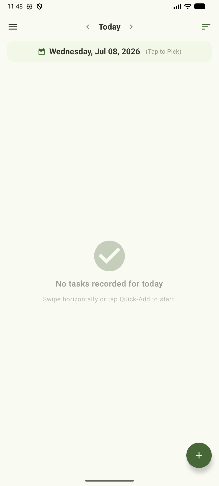</td>
    <td>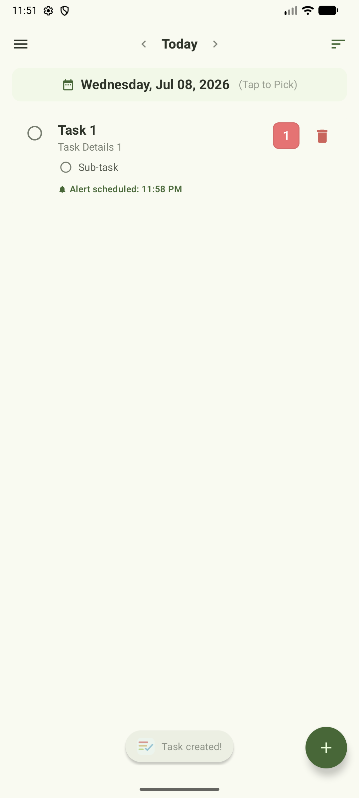</td>
    <td>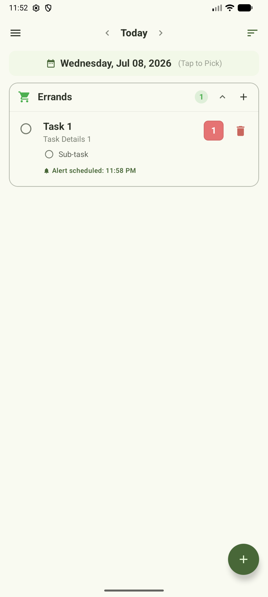</td>
  </tr>
</table>

Task Add Dialog and Edit Dialog
<table>
  <tr>
    <td>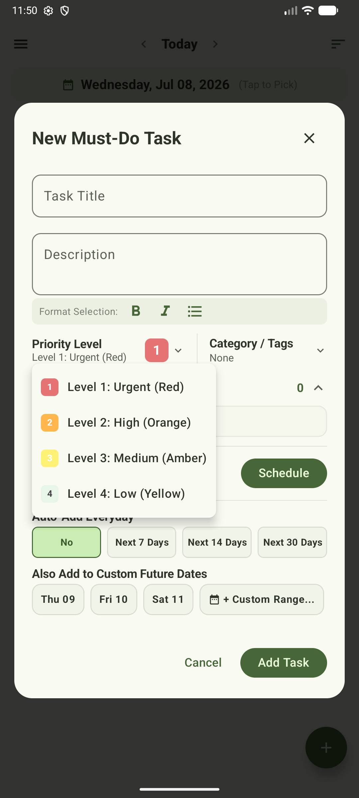</td>
    <td>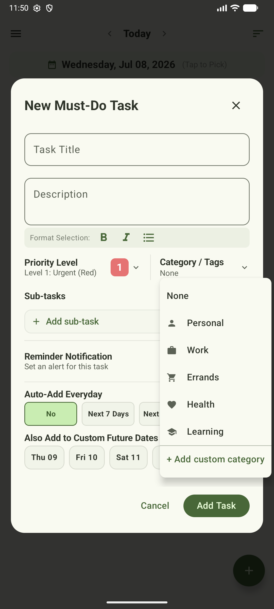</td>
    <td>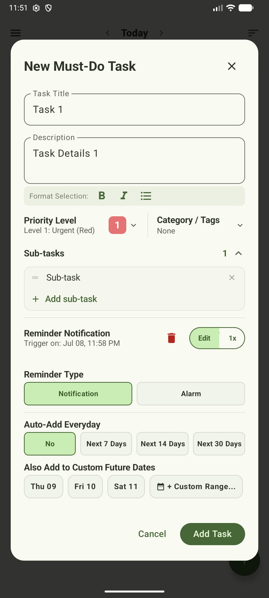</td>
    <td>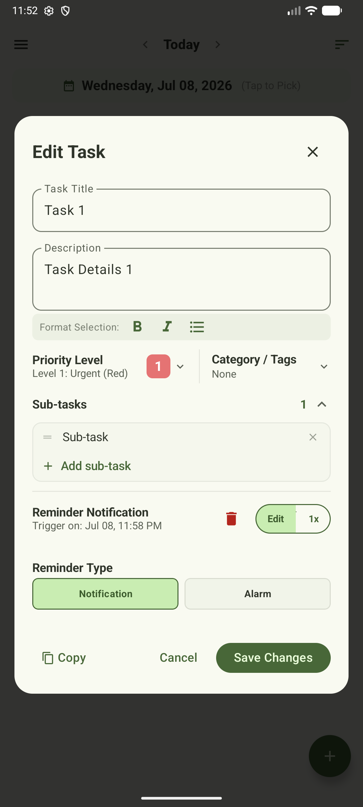</td>
  </tr>
</table>

History Screen - Day, Week, Month and Year view
<table>
  <tr>
    <td>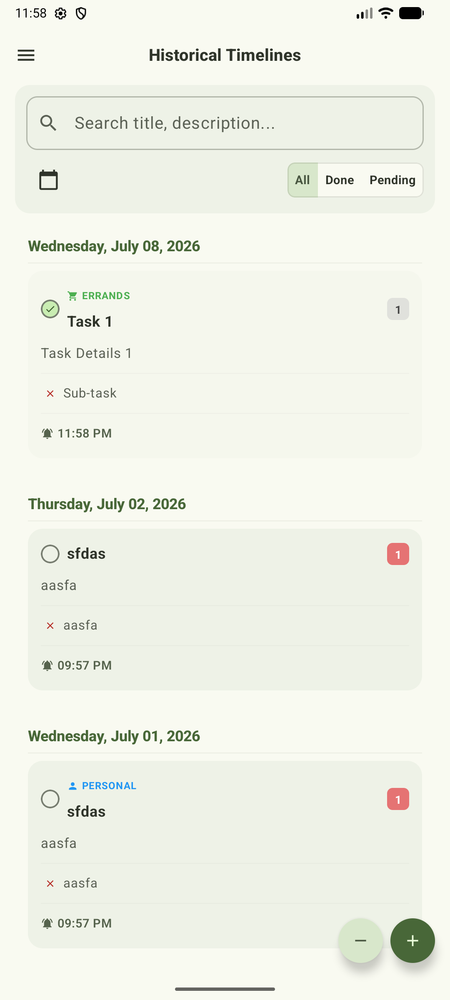</td>
    <td>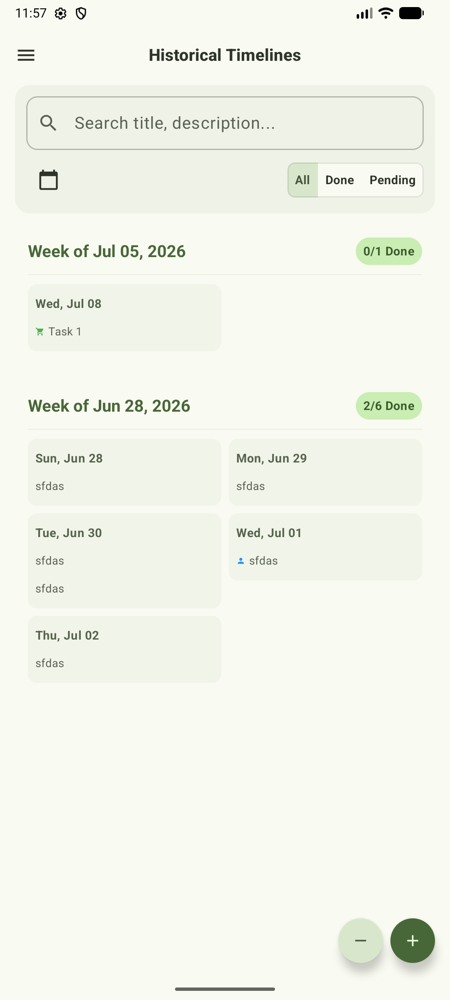</td>
    <td>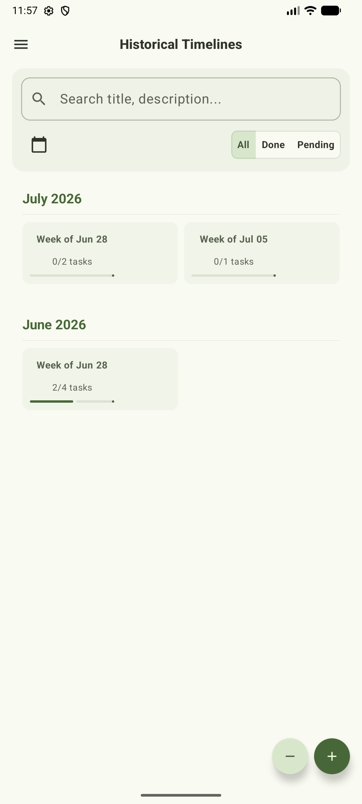</td>
    <td>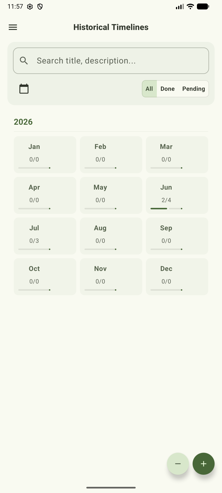</td>
  </tr>
</table>

Stats Screen - Non-interactive
<table>
  <tr>
    <td>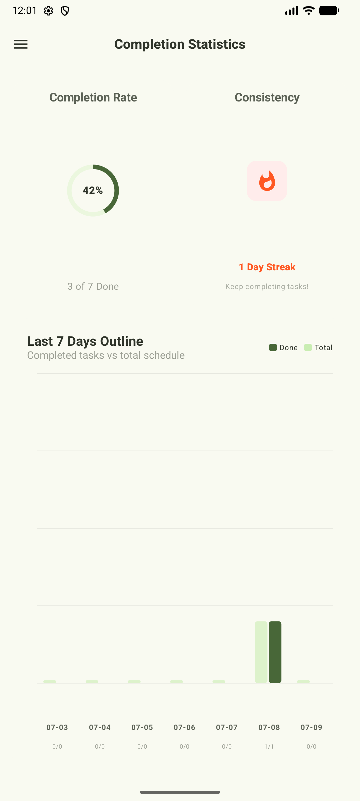</td>
  </tr>
</table>

Settings Screen and Drawer
<table>
  <tr>
    <td>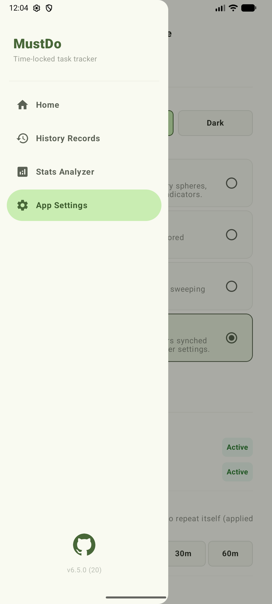</td>
    <td>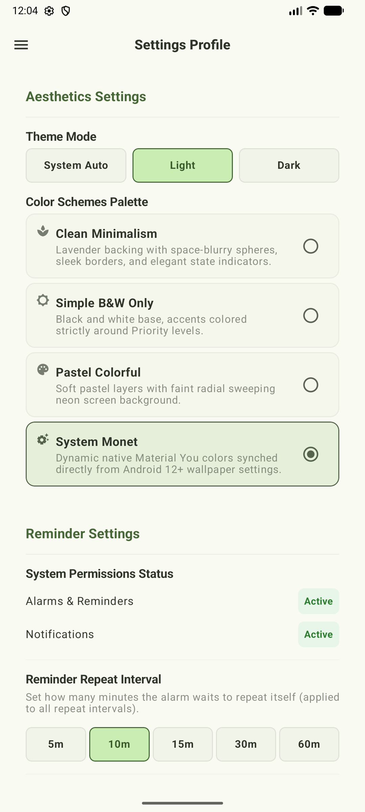</td>
    <td>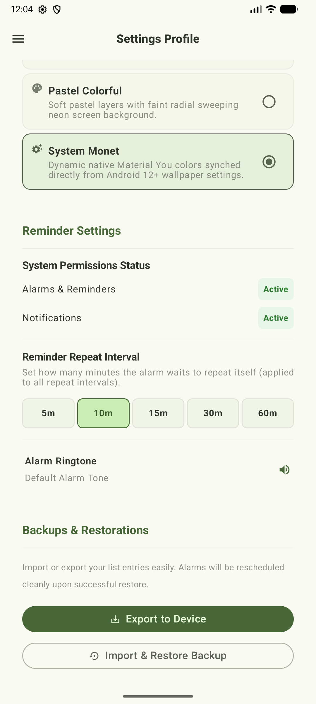</td>
  </tr>
</table>

Themes and Color schemes - Light/Dark
<table>
  <tr>
  <th>Light Mode</th>
    <td>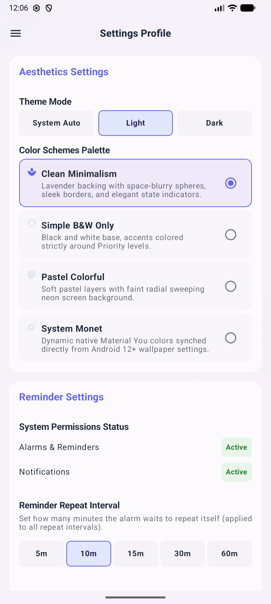</td>
    <td>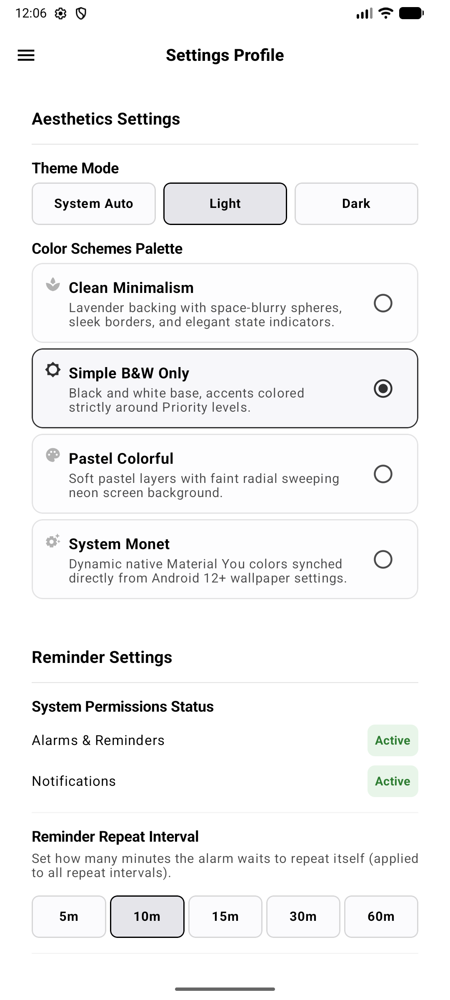</td>
    <td>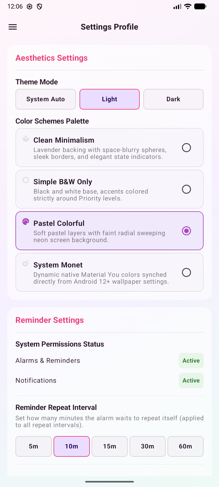</td>
    <td></td>
  </tr>
  <tr>
  <th>Dark Mode</th>
    <td>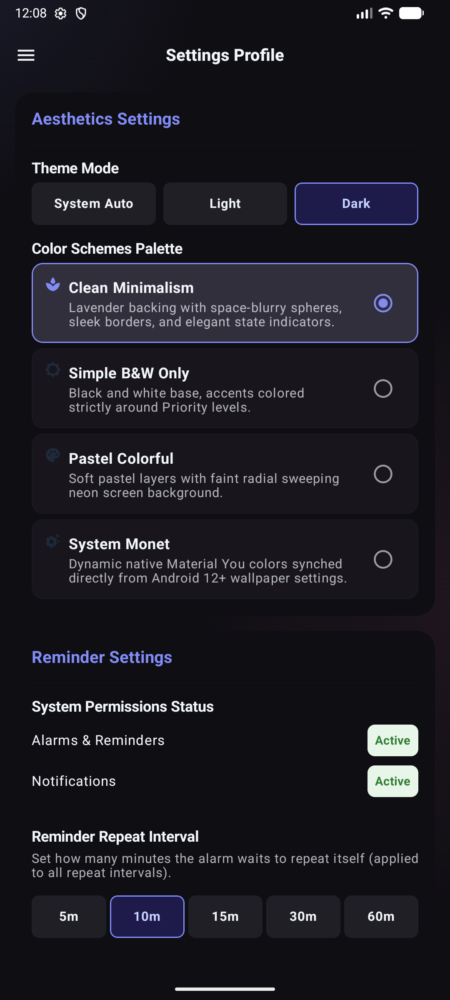</td>
    <td>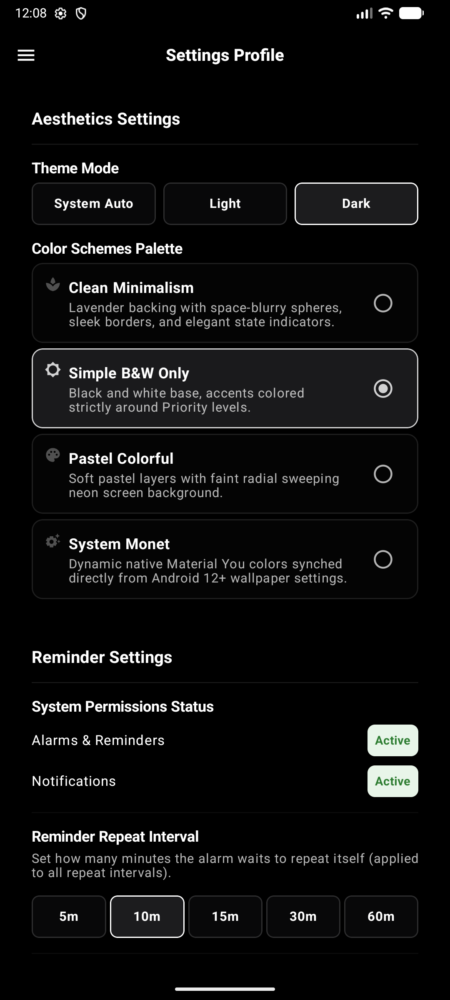</td>
    <td>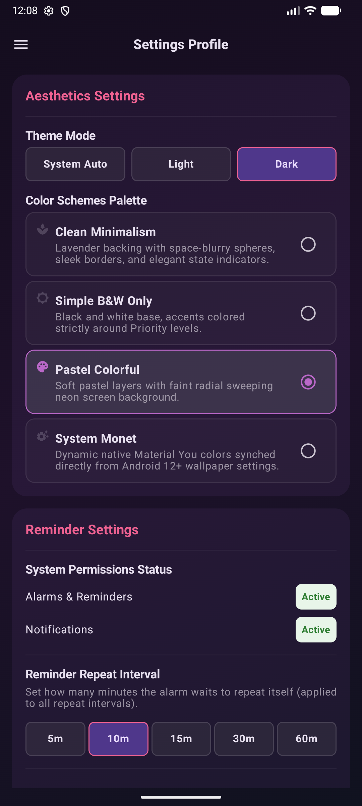</td>
    <td>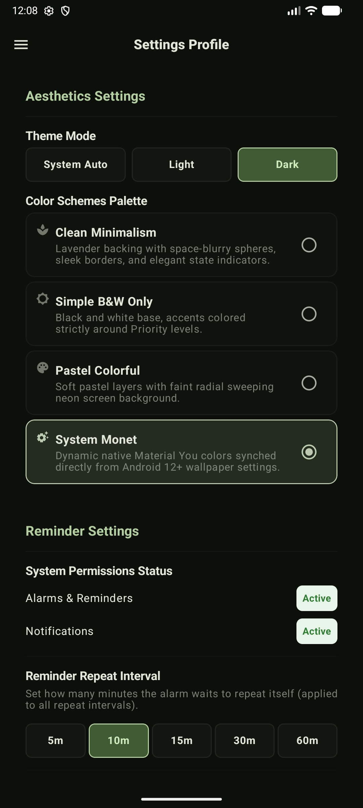</td>
  </tr>
</table>

---

## Features

- Add a task/todo
- Set to notify or ring alarm via scheduling
- Repeat scheduled task
- Repeat a singular task over multiple days while creating.
- Copy/Paste task
- Check consistency, task completion rate and 7-day rolling chart.
- Set custom alarm tone, theme
- Ability to Back up and Restore your task data.
- A history view to see all you past tasks at a glance - can switch between daily, weekly, monthly and yearly views.

---

## Getting Started
- Its quite self-explanatory
---
