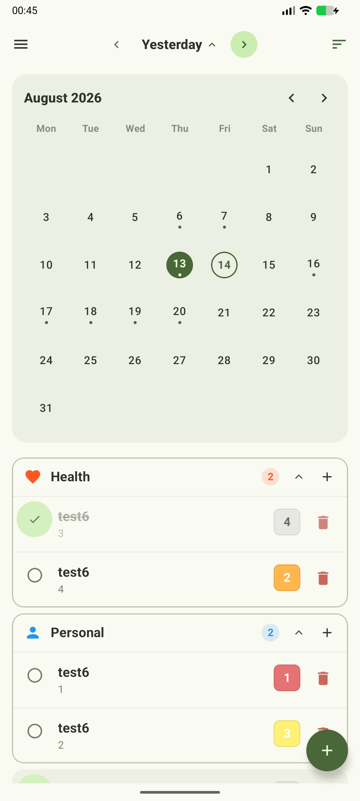
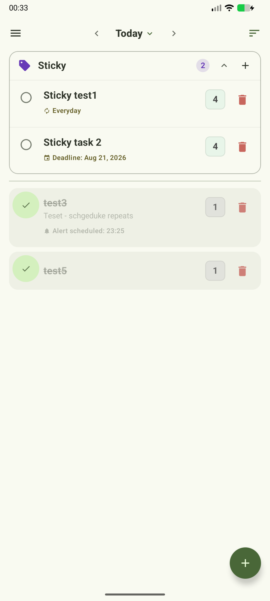
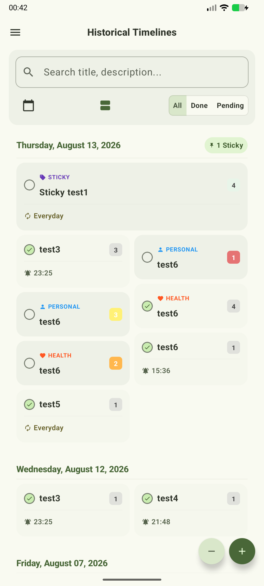

    
    

    <h1>MustDo</h1>

A simple task application that is lightweight and does exactly what a To-do list must do.
It additionally comes with a notification and alarm system. All wrapped in multiple color schemes compatible in both light and dark modes.

**No ads • No subscriptions • No tracking • Completely free**

---

## Features

- Add a task/todo
- Set to notify or ring alarm via scheduling
- Repeat scheduled task
- Repeat a singular task over multiple days while creating.
- Copy/Paste task
- Check consistency, task completion rate and 7-day rolling chart.
- Set custom alarm tone, theme
- Ability to Back up and Restore your task data.
- A history view to see all you past tasks at a glance - can switch between daily, weekly, monthly and yearly views.

---

## Screenshots
Home screen
<table>
  <tr>
    <td></td>
    <td></td>
    <td></td>
    <td></td>
    <td></td>
  </tr>
</table>

Task Add Dialog and Edit Dialog
<table>
  <tr>
    <td></td>
    <td></td>
    <td></td>
    <td></td>
  </tr>
</table>

History Screen - Day, Week, Month and Year view
<table>
  <tr>
    <td></td>
    <td></td>
    <td></td>
    <td></td>
    <td></td>
  </tr>
</table>

Stats Screen - Non-interactive
<table>
  <tr>
    <td></td>
  </tr>
</table>

Settings Screen and Drawer
<table>
  <tr>
    <td></td>
    <td></td>
    <td></td>
  </tr>
</table>

Themes and Color schemes - Light/Dark
<table>
  <tr>
  <th>Light Mode</th>
    <td></td>
    <td></td>
    <td></td>
    <td></td>
  </tr>
  <tr>
  <th>Dark Mode</th>
    <td></td>
    <td></td>
    <td></td>
    <td></td>
  </tr>
</table>

---

## Getting Started
Download the apk file from **_[latest release](github.com/spewedprojects/MustDo/releases/latest)_**.
Google Protect might flag it as a threat and ask to scan before installing, let it scan. **_The app is safe to use._**

#### Home Screen:
- _**Grant the requested permissions. Without these, the app notifications and alarms won't function.**_  
- **To add a new task** - Use "**+**" button at the bottom:
  - Set the task title and description
  - Set the desired Priority level
  - Set the task to any category and add custom categories via dropdown menu (optional).
  - You can add subtasks to this task (optional).
  - Set a scheduled reminder in form of Notification or a full-screen alarm (optional).
  - You can set the task to repeat on multiple days and set the repeat interval or set a custom range.
  - **Sticky tasks**:
    - Sticky tasks is a special category, selecting this category makes the task pinned to the top in home screen.
    - A sticky task when set to repeat every day, will stay pinned on each future day for eternity, until Terminated (via editing).
    - A sticky task when set with a range, becomes a deadline task. This task will stay pinned for the duration of selected dates and can only be stopped once its marked complete on any day.
- You can edit any task by long pressing on it.
- Pressing on today's date at the top will drop down a calendar for you to navigate dates. This calendar will also show dots for any day there is a recorded task.

#### Settings:
- You can enable or disable the sticky task feature if you don't want it.
- The app has multiple themes and color scheme types, you can customize the app colors to your liking.
- Use Export/Import to backup or restore your data.

Explore other screens via navigation drawer.

