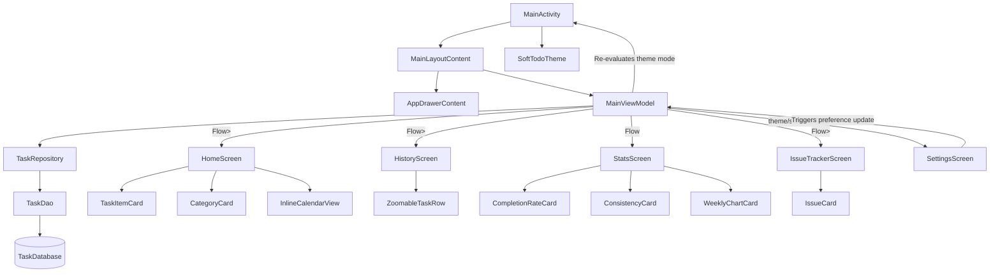

# Codebase Analysis: _MustDo_ To-Do Application

This document provides a thorough breakdown of the **MustDo** Android application architecture, mapping out files, system relationships, color/theme management, typography application, backup/restore operations, and details on recent structural refinements and helpers.

---

## 1. Directory Structure & File Mapping

The codebase follows an MVVM architecture utilizing Jetpack Compose for the UI layer, and Room Database for data persistence. UI components are modularized into domain-focused subpackages under `ui/components/`.

```
app/src/main/
├── AndroidManifest.xml                        # Main configuration, permissions, components registration
├── java/com/gratus/mytodo/
│   ├── AlarmActivity.kt                       # Full-screen activity hosting AlarmScreenContent for ringing alarms
│   ├── MainActivity.kt                        # Host Activity, navigation drawer host, dynamic Edge-to-Edge system bars
│   ├── SnoozeActivity.kt                      # Translucent Activity hosting SnoozeDialogContent for active alarms
│   ├── components/
│   │   ├── AlarmService.kt                   # Foreground service managing media playback for alarms
│   │   ├── BootReceiver.kt                   # BroadcastReceiver to reschedule active alarms after device reboot
│   │   └── NotificationReceiver.kt           # BroadcastReceiver using goAsync() to post exact alarm notifications
│   ├── data/
│   │   ├── Converters.kt                     # Room TypeConverters for lists (subtasks, comments) and custom objects
│   │   ├── IssueItem.kt                      # Room Entity & model: Issue tracker item schema
│   │   ├── Task.kt                           # Room Entity & model: Task data schema
│   │   ├── TaskDao.kt                        # Data Access Object: Queries and DB updates
│   │   ├── TaskDatabase.kt                   # Room Database initializer
│   │   ├── TaskRepository.kt                 # Repository layer abstracting DAO operations
│   │   └── utils/
│   │       └── BackupHelper.kt               # Backup serializer/deserializer to JSON
│   ├── ui/
│   │   ├── MainViewModel.kt                  # State-holder: Business logic, stats calculation, alarm registration
│   │   ├── components/
│   │   │   ├── FaintBackground.kt            # Draws custom canvas graphics/gradients based on theme
│   │   │   ├── InlineCalendarView.kt         # Collapsible inline calendar strip component with task indicators
│   │   │   ├── StyledTextParser.kt           # Compiles markdown bold/italic/bullets into AnnotatedStrings
│   │   │   ├── TaskAddDialog.kt              # Scrollable dialog with Segmented Edit/Repeat buttons
│   │   │   ├── alarm/
│   │   │   │   ├── AlarmScreenContent.kt     # Full-screen critical task alarm overlay layout and previews
│   │   │   │   └── SnoozeDialogContent.kt    # Dialog composable for preset & custom snooze selection
│   │   │   ├── dialogs/
│   │   │   │   └── CategoryChip.kt           # Visual category chip selector and getCategoryIcon helper
│   │   │   ├── history/
│   │   │   │   ├── ExpandedView.kt           # Level 3 expanded detail view and task rows
│   │   │   │   ├── MainFontText.kt           # Custom styled text wrapper for history timelines
│   │   │   │   ├── MonthView.kt              # Level 1 month grid layout
│   │   │   │   ├── WeekView.kt               # Level 2 week list layout
│   │   │   │   ├── YearView.kt               # Level 0 year grid layout
│   │   │   │   └── ZoomableTaskRow.kt        # Multi-level zoomable row dispatcher component
│   │   │   ├── home/
│   │   │   │   ├── CategoryCard.kt           # Category container card and getCategoryAccentColor helper
│   │   │   │   ├── TaskItemCard.kt           # Task item card composable with priority badges & previews
│   │   │   │   └── TaskItemHelpers.kt        # borderStrokeSimple and getPriorityBoxColor helpers
│   │   │   ├── issue/
│   │   │   │   ├── CategoryBadge.kt          # Issue category badge chip and getCategoryColor helper
│   │   │   │   ├── IssueAddDialog.kt         # Dialog for adding/editing issue tracker items
│   │   │   │   └── IssueCard.kt              # Expandable issue card with comment threads & previews
│   │   │   ├── navigation/
│   │   │   │   ├── AppDrawerContent.kt       # Navigation drawer sheet layout and GitHub link
│   │   │   │   └── MainLayoutContent.kt      # Main scaffold layout with TopAppBar and drawer container
│   │   │   └── stats/
│   │   │       ├── CompletionRateCard.kt     # Circular canvas progress card for completion rate
│   │   │       ├── ConsistencyCard.kt        # Streak count card with flame graphics
│   │   │       └── WeeklyChartCard.kt        # Custom Canvas bar chart card for 7-day task outline
│   │   ├── screens/
│   │   │   ├── HomeScreen.kt                 # Daily task list view, datepicker, category filters, and FABs
│   │   │   ├── HistoryScreen.kt              # Calendar groups, zoom FABs, and cumulative zoom gestures
│   │   │   ├── IssueTrackerScreen.kt         # Issue tracker dashboard, search filter, and list container
│   │   │   ├── SettingsScreen.kt             # Preferences, scheme selectors, repeat intervals, and backups
│   │   │   └── StatsScreen.kt                # Stats dashboard assembling completion, streak, and chart cards
│   │   ├── theme/
│   │   │   ├── Color.kt                      # Defines core colors, priority levels, and scheme utilities
│   │   │   ├── Theme.kt                      # Integrates Light/Dark palettes into SoftTodoTheme
│   │   │   └── Type.kt                       # Houses default typography styles with global +2sp offset
│   │   └── utils/
│   │       ├── DateTimeUtils.kt              # Thread-safe date formatters respecting 12h/24h system clock
│   │       └── PinchGestureHelper.kt         # Helper function for tracking cumulative pinch-to-zoom gestures
│   └── widget/
│       ├── TodayAppWidgetProvider.kt         # BroadcastReceiver for widget lifecycle & click events
│       └── TodayWidgetService.kt             # RemoteViewsService for widget list item generation
└── res/
    ├── drawable/
    │   ├── github_mark.xml                   # Github icon vector asset
    │   ├── ic_widget_check.xml               # Checkbox icon for widget items
    │   ├── ic_widget_uncheck.xml             # Unchecked checkbox icon for widget items
    │   ├── icon_v3.xml                       # Vector asset used for launcher and notification small icon
    │   ├── icon_v3_notif.xml                 # Vector asset used for notification small icon
    │   ├── widget_bg.xml                     # Background for widget card
    │   ├── widget_item_bg.xml                # Background for widget task rows
    │   ├── widget_priority_1.xml             # Priority 1 background drawable for widget
    │   ├── widget_priority_2.xml             # Priority 2 background drawable for widget
    │   ├── widget_priority_3.xml             # Priority 3 background drawable for widget
    │   ├── widget_priority_4.xml             # Priority 4 background drawable for widget
    │   └── widget_priority_completed.xml     # Completed state priority background drawable for widget
    ├── layout/
    │   ├── widget_task_item.xml              # Widget item card row layout
    │   └── widget_today.xml                  # Main Today widget layout container
    ├── values/
    │   ├── colors.xml                        # Basic standard fallback native resource colors
    │   ├── strings.xml                       # Core localization properties
    │   └── themes.xml                        # Legacy XML styles providing parent compatibility
    └── xml/
        ├── backup_rules.xml                  # Rules for Android Auto Backup
        ├── data_extraction_rules.xml         # Rules for cloud/device backup extraction
        └── widget_today_info.xml             # Configuration rules for the widget
```

---

## 2. System Relationships & State Propagation

The app leverages a shared ViewModel architecture to ensure state syncs instantly across all screens. View layer components are cleanly separated into stateless composables and top-level screen containers:



### Key Interactions:
1. **Shared ViewModel Scope:** `MainActivity` instantiates `MainViewModel` via `by viewModels()`. This single instance is passed down to all sub-screens (`HomeScreen`, `HistoryScreen`, `StatsScreen`, `SettingsScreen`, `IssueTrackerScreen`), ensuring consistent state across the app.
2. **Stateless UI Component Extraction:** Heavy UI components (e.g. `MainLayoutContent`, `AppDrawerContent`, `TaskItemCard`, `CategoryCard`, `ZoomableTaskRow`, `IssueCard`, `WeeklyChartCard`, `AlarmScreen`, `SnoozeDialog`) are extracted into decoupled, standalone composables. They receive explicit state parameters and pass user actions upward via lambda callbacks, enabling localized `@Preview` previews in light/dark/theme variants.
3. **Settings Propagation:** 
   - `SettingsScreen` invokes `viewModel.setTheme(mode)` and `viewModel.setColorScheme(scheme)`.
   - `MainViewModel` persists these settings in `SharedPreferences` (`soft_todo_prefs`) and publishes updates to `settingsTheme` and `settingsColorScheme` state flows.
   - `MainActivity` collects these flows as Compose state, triggering a recomposition of `SoftTodoTheme` and `FaintBackground` that instantly updates the app's visual theme.
4. **Database-UI Reactive Loop:** All queries inside `TaskDao` return `Flow<List<Task>>` or `Flow<List<IssueItem>>`. Any mutation (e.g. marking a task complete on `HomeScreen`) writes to Room, which automatically forces the corresponding Flow to emit updated data.
5. **Alarms Synchronization:** When tasks are added, completed, updated, or deleted, `MainViewModel` schedules or cancels exact alarms using `AlarmManager`.
6. **Widget Reactive Syncing & Quick Actions:** When task state changes, `MainViewModel` broadcasts a `com.gratus.mytodo.action.WIDGET_UPDATE` intent, causing `TodayAppWidgetProvider` to request list view updates. Tapping the checkbox in the widget fires `TOGGLE_COMPLETE` to update DB task completion, while tapping the Add Task shortcut button in the widget opens `MainActivity` directly with task creation intents.

---

## 3. Backup and Restore Mechanism

Backups are managed via JSON serialization/deserialization and raw SQLite DB file import/export:

### Export Workflow
1. User clicks **Export to Device** in `SettingsScreen`.
2. The UI invokes `viewModel.exportBackup()`.
3. `exportBackup` queries `TaskDatabase` for all tasks via `getAllTasksDirect()` on `Dispatchers.IO`.
4. It iterates over the task list, converting each field into a `JSONObject` and appending them to a `JSONArray`.
5. The output is written to `todo_backup.json` inside the device's public `Downloads` directory via Android's `MediaStore`. Concurrently, a raw DB backup copy is saved to `todo_backup.db`.

### Import & Restore Workflow
1. User clicks **Import & Restore Backup** in `SettingsScreen` which opens the system file picker (`*/*`).
2. The selected file URI is handled via `viewModel.importBackupUri(uri)`. The file's magic bytes are read on `Dispatchers.IO`:
   - If they match `"SQLite format 3"`, the active database is closed, the raw `.db` file is imported directly overwriting `task_database`, and the app triggers a restart.
   - Otherwise, the file is parsed as JSON, all existing alarms are cancelled, tasks are inserted into the database, and `NotificationReceiver.rescheduleAllAlarms(context)` is called.
3. Callbacks are invoked on the Main thread to display UI toasts, avoiding background thread crashes.

---

## 4. Typography & Font Application

The app uses a centralized typography structure to maintain visual consistency across all screens:

- **Type.kt** maps material typography tokens to unified styles where every font size is increased by **+2sp** compared to standard system size rules.
- **AppFontSizes** contains helper size scales (ranging from `micro = 10.sp` to `headline = 26.sp`) that are used across all screens instead of hardcoded sizes.
- **Dynamic Zoom Sizes:** History screen text size scales dynamically based on the active pinch-to-zoom level through `AppFontSizes.titleForZoom(level)` and `AppFontSizes.bodyForZoom(level)`.

---

## 5. Theme & Color Management

Colors are managed inside `Theme.kt` and `Color.kt` through standard Compose parameters and style provider classes.

- **`SoftTodoTheme` Selection:** Translates setting codes to M3 ColorSchemes:
  - `"minimal"`: Indigo and lavender accents.
  - `"simple"`: Strictly monochromatic (black/white).
  - `"colorful"`: Orchid purple + rose pastel with radial sweep animations.
  - `"system"`: Monet dynamic coloring (Android 12+).
- **Badge & Accent Colors:** Priority badges and category cards dynamically style container colors and borders based on the selected scheme (e.g. `getMinimalPriorityColors()`, `getPriorityBoxColor()`, `getCategoryAccentColor()`, `getCategoryColor()`).
- **Monochromatic Simple Theme Tinting:** In `"simple"` B&W scheme mode, category icons, category badges, chips, and headers render using monochromatic black/white tinting rather than vibrant colors.
- **Drawer Styling:** `AppDrawerContent` uses a solid, non-transparent sheet background for `"minimal"` and `"colorful"` themes to prevent visual overlap issues.
- **Delete Dialog Styling:** Deletion confirmation alert dialogs are styled with outlines matching the active theme's borders (black/white in Simple, slate/indigo in Minimal) to prevent them from blending into monochromatic backgrounds.

---

## 6. Recommended Helper Classes & Refinements

1. **Modular Subpackage Architecture:** UI composables are cleanly separated into domain subpackages (`home`, `history`, `issue`, `stats`, `dialogs`, `navigation`, `alarm`). Screen container files (`HomeScreen.kt`, `HistoryScreen.kt`, `IssueTrackerScreen.kt`, `StatsScreen.kt`, `MainActivity.kt`, `AlarmActivity.kt`, `SnoozeActivity.kt`) contain layout orchestration while delegating modular rendering to component files.
2. **`DateTimeUtils`:** Thread-safe utility helper that centralizes all Date/Time formatting and parsing operations. It queries `DateFormat.is24HourFormat(context)` to dynamically display reminder timestamps in either 12-hour or 24-hour format matching system preferences.
3. **`InlineCalendarView`:** Interactive horizontal date strip component displayed on `HomeScreen` with task status indicator dots (marking days with active or completed tasks) and a Jump-to-Today action button.
4. **History Task Tap Navigation:** Tapping any task row in `HistoryScreen` (across Year, Month, Week, or Expanded views) updates `focusDate` in `MainViewModel` to the task's date and navigates immediately to `HomeScreen`.
5. **`PinchGestureHelper`:** Implements `detectPinchZoom` which accumulates relative zoom events over a single gesture cycle and triggers zoom-in or zoom-out callbacks only when threshold boundaries (e.g., > 1.25x or < 0.75x) are crossed, resolving slow gesture dead-zones. Checks pointer counts so single-finger navigation or drawer gestures are ignored by the zoom handler.
6. **`NotificationReceiver`**: Extends `BroadcastReceiver` and uses `goAsync()` to run database lookups on a background coroutine while keeping the receiver process alive. Includes interactive notification buttons: `"Mark Complete"` and `"Stop"`, handling these actions inside `onReceive()`. Uses `R.drawable.icon_v3_notif` for notification small icons.
7. **`SCHEDULE_EXACT_ALARM`**: Declared in the manifest (having removed `USE_EXACT_ALARM` to ensure proper visibility in system settings and avoid Play Store rejections). System permission state is checked via `AlarmManager.canScheduleExactAlarms()` alongside `POST_NOTIFICATIONS` runtime checks.
8. **`TodayAppWidgetProvider` & `TodayWidgetService`**: Implements a home screen widget showing today's tasks using `RemoteViews` and a `RemoteViewsService`. Supports task completions toggled directly from the home screen and includes an Add Task shortcut button in the widget footer bar. Refactored to use `goAsync()` in broadcast handlers to prevent background database write crashes. Kept in ProGuard configuration (`proguard-rules.pro`).
9. **Room Database Migrations**: SQLite migrations (`MIGRATION_1_2`, `MIGRATION_2_3`, etc.) upgrade user tables to include `repeatCount`, `repeatedTimes`, `isReminderActive`, `nextReminderTime`, and `IssueItem` entities, supporting repeating alarm triggers and issue tracking without database resets or data loss.
10. **Boot Rescheduling**: `BootReceiver` listens for `ACTION_BOOT_COMPLETED` and automatically calls `NotificationReceiver.rescheduleAllAlarms(context)` so users do not lose pending reminders after a device restart.
11. **Alarm & Snooze Components**: `AlarmService` provides a foreground service playing custom media ringtones while `AlarmScreenContent` (in `AlarmActivity`) displays a full-screen notification overlay. `SnoozeDialogContent` (in `SnoozeActivity`) offers a UI for deferring reminders dynamically (e.g., 5m, 10m, 15m, 30m, custom).
12. **Subtasks, Categories & Issue Tracker**: `Task` entities support nested `subTasks` (converted to JSON strings in Room via `Converters.kt`) and `category` tags. `IssueItem` entities manage issue tracker items with serial numbers, category badges (`Issue`, `Feature`, `Idea`), descriptions, markdown styling, and nested `comments`.

---

## 7. Evolution & Fundamental Changes Summary

The application has undergone several key transitions since its initial version:

| Feature / Area                          | June 10th and Initial Versions                                                                                                                                        | Current Refined Version                                                                                                                                                                                                                                                                                                               |
|:----------------------------------------|:----------------------------------------------------------------------------------------------------------------------------------------------------------------------|:--------------------------------------------------------------------------------------------------------------------------------------------------------------------------------------------------------------------------------------------------------------------------------------------------------------------------------------|
| **Component Architecture**              | Inline composable functions tightly coupled within large screen files (e.g. `HomeScreen.kt`, `HistoryScreen.kt`, `IssueTrackerScreen.kt`, `MainActivity.kt`).         | Extracted into modular, domain-scoped subpackages under `com.gratus.mytodo.ui.components.*` (`home`, `history`, `issue`, `stats`, `dialogs`, `navigation`, `alarm`), promoting single-responsibility, maintainability, reusability, and standalone Compose `@Preview` support across light/dark/theme variants.                       |
| **History Task Navigation**             | Tapping past tasks in History screen only expanded/collapsed card details or had no navigation effect.                                                                | Tapping any task row in `HistoryScreen` updates `focusDate` in `MainViewModel` to the task's date and navigates directly to `HomeScreen` for immediate date context and editing.                                                                                                                                                      |
| **Monochromatic Simple Category Theme** | Category icons and tags maintained full vibrant colors even when Simple B&W theme mode was active.                                                                    | Automatically tints category icons, chips, and badge borders with monochromatic black/white tones when Simple B&W scheme is active (Serial #29).                                                                                                                                                                                      |
| **Inline Calendar View**                | Date selection relied exclusively on standard top app bar date labels or full date picker dialogs.                                                                    | Integrated `InlineCalendarView.kt` featuring a scrollable horizontal day strip, task indicator dots, and a Jump-to-Today shortcut button (Serial #27).                                                                                                                                                                                |
| **Widget Add Task Shortcut**            | Widget only supported viewing today's tasks and toggling task completion checkmarks.                                                                                  | Added an "Add Task" shortcut button in the widget footer bar (`TodayAppWidgetProvider`) to launch `MainActivity` directly with task creation intents (Serial #34).                                                                                                                                                                    |
| **Pinch-to-Zoom**                       | Zoom gestures were broken because they processed instantaneous frame-deltas, failing to register slow gestures.                                                       | Uses a custom `PinchGestureHelper` for smooth transitions across 4 custom zoom levels: Year (12-month grids, click to zoom), Month (week grids, click to zoom), Week (day grids with 1-line titles + summary, click to zoom), and Regular View (detailed task list).                                                                  |
| **Reminder Dialog Flow**                | Required the user to pick a date first, then pick a time.                                                                                                             | Directly opens the `TimePickerDialog`, automatically applying the chosen time to the task's main target date.                                                                                                                                                                                                                         |
| **Landscape Usability**                 | Dialogs and Stats screens overflowed and got cut off in landscape mode.                                                                                               | Dialog content is fully scrollable. The Stats Screen utilizes weights for an adaptive layout with no vertical scrollbar (side-by-side top cards in portrait, stacked left cards in landscape; chart on bottom in portrait, chart on right in landscape).                                                                              |
| **Notification Reliability**            | Fails silently on Android 13+ due to lack of pre-granted exact alarm permissions. Queries database asynchronously in `BroadcastReceiver` causing process termination. | Uses the pre-granted `USE_EXACT_ALARM` permission, implements `goAsync()` in the BroadcastReceiver to protect background queries, and uses a local drawable to prevent system icon resource crashes.                                                                                                                                  |
| **System Bar Icons**                    | Icons remained dark when the system was in light mode and the app was manually toggled to dark mode, making them invisible.                                           | Dynamically checks calculated theme state in `LaunchedEffect` and calls `enableEdgeToEdge()` with custom `SystemBarStyle` configs on theme change.                                                                                                                                                                                    |
| **Time Format Preference**              | Hardcoded to 12-hour format across the app.                                                                                                                           | Dynamically queries system settings using `is24HourFormat(context)` and formats both pickers and visual text labels accordingly.                                                                                                                                                                                                      |
| **Layout Outlines & Dialogs**           | Alert dialogs had default styling without borders, blending into monochromatic themes.                                                                                | Applied custom borders to `AlertDialog` to match the outline properties of Clean Minimalism and Simple B&W themes.                                                                                                                                                                                                                    |
| **Stats Completion Metric**             | Calculated rate and done ratios using all tasks, including those scheduled in the future.                                                                             | Stats completion rate and "x of y Done" counts are filtered to only evaluate tasks up to today's date.                                                                                                                                                                                                                                |
| **History Records List**                | Displayed future tasks alongside completed and past tasks.                                                                                                            | Filters out future tasks from the History records by default, but displays them when the user explicitly searches/filters by a date or month pattern.                                                                                                                                                            me                   |
| **Dialog State Rotation**               | Closing the add/edit dialog on rotation caused data loss.                                                                                                             | Moves dialog state and edited task items to `MainViewModel` and implements `rememberSaveable` on dialog input fields to persist state across device rotations.                                                                                                                                                                        |
| **Alarm Time Info**                     | Hides alert time info from completed tasks or once the alarm time has passed.                                                                                         | Keeps the "Alert scheduled: ..." info text visible on the home task card even after it has triggered or the task has been marked complete.                                                                                                                                                                                            |
| **Header Date text**                    | Displayed formatted date in TopAppBar for all active dates.                                                                                                           | Displays `"Today"` instead of formatted date in the TopAppBar of `MainActivity` if the active date matches the current system date.                                                                                                                                                                                                   |
| **Home Screen Widget**                  | No widget support.                                                                                                                                                    | Adds an interactive "MustDo Today" widget showing today's tasks, priority levels, completion state, and supporting direct task check-off toggle.                                                                                                                                                                                      |
| **Repeating Reminders**                 | Standard alarm reminder triggers once.                                                                                                                                | Supports `1x` (default) up to `4x` repeat reminder cycles at a customizable interval configured in Settings. UI replaces schedule button with an Edit/Repeat Segmented Button when active.                                                                                                                                            |
| **History Zoom / Gestures**             | Pinch-to-zoom gesture conflicted with navigation drawer drag and had no alternative control buttons.                                                                  | Resolves touch conflict by ignoring single-finger swipes. Adds horizontal `+` and `-` FAB controls in the bottom right corner with `80.dp` bottom list padding to clear them.                                                                                                                                                         |
| **Widget Process Stability**            | Tasks checked off in the widget caused background database write failures and made the widget static or blank due to receiver process termination.                    | Wraps background operations in `goAsync()` within broadcast receivers. Re-fetches task database dynamically in `onDataSetChanged()` to handle connection pool lifecycle.                                                                                                                                                              |
| **Widget Dark Mode**                    | Hardcoded layout/drawable colors were used, which did not support system dark theme.                                                                                  | Replaced hex values with semantic color resources in `res/values/colors.xml` and `res/values-night/colors.xml`.                                                                                                                                                                                                                       |
| **Exact Alarm & Notification Warnings** | Revoking alarm/notification permissions resulted in silent failure of scheduled reminders.                                                                            | Added StateFlow permission checks updated on `onResume()`. Displays a modern warning card banner on the Home screen and detailed status badges with direct settings navigation links on the Settings screen.                                                                                                                          |
| **Notification Action Buttons**         | Notification displays plain text only; user must open the app to complete/dismiss reminders.                                                                          | Added `"Mark Complete"` (completes task, cancels alarm, updates widget, dismisses notification) and `"Stop"` (suspends future alerts by setting `isReminderActive = false`, cancels alarm, updates widget, dismisses notification) actions directly inside the notification banner, preserving the original scheduled `reminderTime`. |
| **Alarms settings visibility**          | App is missing from system "Alarms & Reminders" special access settings list.                                                                                         | Removed `USE_EXACT_ALARM` signature permission, leaving only `SCHEDULE_EXACT_ALARM` to ensure native inclusion in system settings lists.                                                                                                                                                                                              |
| **Release Mode Widget Bug**             | Widget is frozen, blank, or fails to react to clicks in Release builds.                                                                                               | Appended ProGuard keep rules for widget classes (`com.gratus.mytodo.widget.**`) to prevent R8 compiler optimization and class/method obfuscation from breaking the RemoteViewsService binder transactions.                                                                                                                            |
| **Repeating Alarm Time Preservation**   | Alarms were previously scheduled by modifying `reminderTime` to the next repeating timestamp, losing the original time.                                               | Calculates dynamic trigger times using `nextReminderTime` and preserves original `reminderTime` in the database. Visual text on Home/History appends `" (repeated Xx)"` or shows `"Alert suspended"` with a `NotificationsOff` icon.                                                                                                  |
| **Sub-tasks & Categories**              | Tasks were flat entities with a single completion state.                                                                                                              | Introduced `subTasks` support within `Task` entities via Room TypeConverters. Added category tags. The UI updates the parent task's completion state dynamically based on subtask progress.                                                                                                                                           |
| **Full-Screen Alarms & Ringtones**      | Alarms relied solely on standard system notifications.                                                                                                                | Added `AlarmService` and `AlarmActivity` to play custom ringtones and show full-screen overlays when the device is locked.                                                                                                                                                                                                            |
| **Comprehensive Snooze**                | Only "Mark Complete" or "Stop" actions were available.                                                                                                                | Implemented `SnoozeActivity` and updated `NotificationReceiver` to allow users to defer alarms dynamically, tracking `snoozedUntil` state in the database.                                                                                                                                                                            |
| **Boot Resiliency**                     | Scheduled exact alarms were cleared and lost when the device was rebooted.                                                                                            | Added `BootReceiver` to automatically restore and reschedule all active exact alarms on system startup.                                                                                                                                                                                                                               |
| **Backup Threading Stability**          | Database imports crashed if they displayed a Toast on the IO thread.                                                                                                  | Refactored `importBackupUri` to handle all file reads and DB overwrites on `Dispatchers.IO` and post Toast completion callbacks on the Main thread.                                                                                                                                                                                   |
| **License Headers**                     | No explicit licensing.                                                                                                                                                | Added GNU GPL v3 License and copyright headers to project source files.                                                                                                                                                                                                                                                               |
