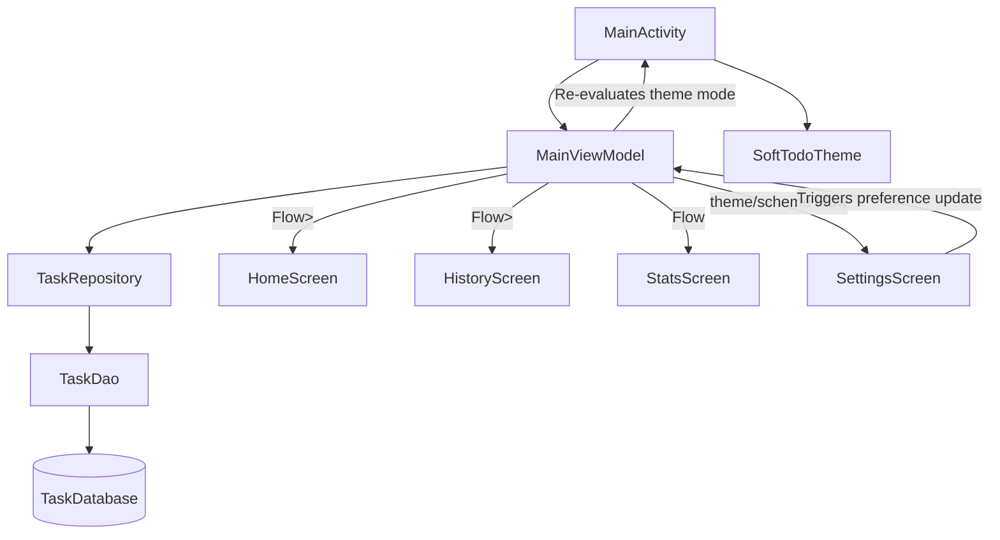

# Codebase Analysis: _MustDo_ To-Do Application

This document provides a thorough breakdown of the **MustDo** Android application architecture, mapping out files, system relationships, color/theme management, typography application, backup/restore operations, and details on recent structural refinements and helpers.

---

## 1. Directory Structure & File Mapping

The codebase follows an MVVM architecture utilizing Jetpack Compose for the UI layer, and Room Database for data persistence.

```
app/src/main/
├── AndroidManifest.xml                        # Main configuration, permissions, components registration
├── java/com/gratus/mytodo/
│   ├── MainActivity.kt                        # Host Activity, Navigation Drawer, dynamic Edge-to-Edge system bar icons
│   ├── components/
│   │   └── NotificationReceiver.kt           # BroadcastReceiver using goAsync() to post exact alarms notifications
│   ├── data/
│   │   ├── Task.kt                           # Room Entity: Task data schema
│   │   ├── TaskDao.kt                        # Data Access Object: Queries and DB updates
│   │   ├── TaskDatabase.kt                   # Room Database initializer
│   │   ├── TaskRepository.kt                 # Repository layer abstracting DAO operations
│   │   └── utils/
│   │       └── BackupHelper.kt               # Backup serializer/deserializer to JSON
│   ├── ui/
│   │   ├── MainViewModel.kt                  # State-holder: Business logic, stats calculation, alarm registration
│   │   ├── components/
│   │   │   ├── FaintBackground.kt            # Draws custom canvas graphics/gradients based on theme
│   │   │   ├── StyledTextParser.kt           # Compiles markdown bold/italic/bullets into AnnotatedStrings
│   │   │   └── TaskAddDialog.kt              # Scrollable dialog with Segmented Edit/Repeat buttons
│   │   ├── screens/
│   │   │   ├── HomeScreen.kt                 # Daily task list view, datepicker, and HorizontalPager
│   │   │   ├── HistoryScreen.kt              # Calendar groups, zoom FABs, and cumulative zoom gestures
│   │   │   ├── SettingsScreen.kt             # Preferences, scheme selectors, repeat intervals, and backups
│   │   │   └── StatsScreen.kt                # Scrollable circular completion progress, streaks, and weekly chart
│   │   ├── theme/
│   │   │   ├── Color.kt                      # Defines core colors, priority levels, and scheme utilities
│   │   │   ├── Theme.kt                      # Integrates Light/Dark palettes into SoftTodoTheme
│   │   │   └── Type.kt                       # Houses default typography styles with global +2sp offset
│   │   └── utils/
│   │       ├── DateTimeUtils.kt              # Thread-safe date formatters respecting 12h/24h system clock
│   │       └── PinchGestureHelper.kt         # Helper function for tracking cumulative pinch-to-zoom gestures
│   └── widget/
│       ├── TodayAppWidgetProvider.kt         # BroadcastReceiver for widget lifecycle & click events
│       └── TodayWidgetService.kt             # RemoteViewsService for widget list item generation
└── res/
    ├── drawable/
    │   ├── ic_widget_check.xml               # Checkbox icon for widget items
    │   ├── ic_widget_uncheck.xml             # Unchecked checkbox icon for widget items
    │   ├── icon_v3.xml                       # Vector asset used for launcher and notification small icon
    │   ├── widget_bg.xml                     # Background for widget card
    │   ├── widget_item_bg.xml                # Background for widget task rows
    │   ├── widget_priority_1.xml             # Priority 1 background drawable for widget
    │   ├── widget_priority_2.xml             # Priority 2 background drawable for widget
    │   ├── widget_priority_3.xml             # Priority 3 background drawable for widget
    │   ├── widget_priority_4.xml             # Priority 4 background drawable for widget
    │   └── widget_priority_completed.xml     # Completed state priority background drawable for widget
    ├── layout/
    │   ├── widget_task_item.xml              # Widget item card row layout
    │   └── widget_today.xml                  # Main Today widget layout container
    ├── values/
    │   ├── colors.xml                        # Basic standard fallback native resource colors
    │   ├── strings.xml                       # Core localization properties
    │   └── themes.xml                        # Legacy XML styles providing parent compatibility
    └── xml/
        ├── backup_rules.xml                  # Rules for Android Auto Backup
        ├── data_extraction_rules.xml         # Rules for cloud/device backup extraction
        └── widget_today_info.xml             # Configuration rules for the widget
```

---

## 2. System Relationships & State Propagation

The app leverages a shared view model architecture to ensure state syncs instantly across all screens:



### Key Interactions:
1. **Shared ViewModel Scope:** The `MainActivity` instantiates `MainViewModel` via `by viewModels()`. This single instance is passed to all sub-screens (`HomeScreen`, `HistoryScreen`, `StatsScreen`, `SettingsScreen`), ensuring they all operate on the exact same states.
2. **Settings Propagation:** 
   - `SettingsScreen` invokes `viewModel.setTheme(mode)` and `viewModel.setColorScheme(scheme)`.
   - `MainViewModel` persists these settings in `SharedPreferences` (`soft_todo_prefs`) and publishes updates to `settingsTheme` and `settingsColorScheme` state flows.
   - `MainActivity` collects these flows as compose state. This triggers a recomposition of `SoftTodoTheme` and `FaintBackground`, changing the entire app's look instantly.
3. **Database-UI Reactive Loop:** All queries inside `TaskDao` return `Flow<List<Task>>`. Any operation (e.g. marking a task complete on the `HomeScreen`) writes to Room, which automatically forces the corresponding database flow to emit the new data. Screens instantly recompose with the updated task lists without manual refreshing.
4. **Alarms Synchronization:** When tasks are added, completed, updated, or deleted, `MainViewModel` schedules or cancels exact alarms using `AlarmManager`.
5. **Widget Reactive Syncing:** When task state changes, `MainViewModel` broadcasts a `com.gratus.mytodo.action.WIDGET_UPDATE` intent, causing `TodayAppWidgetProvider` to request list view updates. Tapping the checkbox in the widget fires a `com.gratus.mytodo.action.TOGGLE_COMPLETE` broadcast which toggles the task completion in the database on a background coroutine, triggers database alarm rescheduling via `NotificationReceiver`, and alerts the widget to redraw.

---

## 3. Backup and Restore Mechanism

Currently, backups are handled via raw JSON serialization and deserialization:

### Export Workflow
1. User clicks **Export to Device** in `SettingsScreen`.
2. The UI invokes `viewModel.exportBackup()`.
3. `exportBackup` queries `TaskDatabase` for all tasks via `getAllTasksDirect()` on `Dispatchers.IO`.
4. It iterates over the task list, converting each field into a `JSONObject` and adding them to a `JSONArray`.
5. The output is written to `todo_backup.json` inside the device's public `Downloads` directory via Android's `MediaStore`. Concurrently, a raw DB backup copy is saved to `todo_backup.db`.

### Import & Restore Workflow
1. User clicks **Import & Restore Backup** in `SettingsScreen` which opens the system file picker (`*/*`).
2. The selected file's magic bytes are read:
   - If they match `"SQLite format 3"`, the raw `.db` file is imported, overwriting `task_database`, and the app restarts.
   - Otherwise, the file is parsed as JSON, and the tasks are inserted into the database.
3. Alarms are rescheduled for any active, incomplete tasks.

---

## 4. Typography & Font Application

The app uses a centralized typography structure to maintain visual consistency across all screens:

- **Type.kt** maps material typography tokens to unified styles where every font size is increased by **+2sp** compared to standard system size rules.
- **AppFontSizes** contains helper size scales (ranging from `pico = 10.sp` to `headline = 26.sp`) that are used across all screens instead of hardcoded sizes.
- **Dynamic Zoom Sizes:** History screen text size scales dynamically based on the active pinch-to-zoom level through `AppFontSizes.titleForZoom(level)` and `AppFontSizes.bodyForZoom(level)`.

---

## 5. Theme & Color Management

Colors are managed inside `Theme.kt` and `Color.kt` through standard Compose parameters and style provider classes.

- **`SoftTodoTheme` Selection:** Translates setting codes to M3 ColorSchemes:
  - `"minimal"`: Indigo and lavender accents.
  - `"simple"`: strictly monochromatic (black/white).
  - `"colorful"`: Orchid purple + rose pastel with radial sweep animations.
  - `"system"`: Monet dynamic coloring (Android 12+).
- **Badge Colors:** Priority badges dynamically style their box container and borders based on the selected scheme (e.g. using `getMinimalPriorityColors()` or `getPriorityBoxColor()`).
- **Drawer Styling:** The navigation drawer uses a solid, non-transparent sheet background for `"minimal"` and `"colorful"` themes to prevent visual overlap issues.
- **Delete Dialog Styling:** The deletion confirmation alert dialog is styled with outlines matching the active theme's borders (black/white in Simple, slate/indigo in Minimal) to prevent it from blending into the background of monochromatic screens.

---

## 6. Recommended Helper Classes & Refinements

1. **`DateTimeUtils`:** Thread-safe utility helper that centralizes all Date/Time formatting and parsing operations. It queries `DateFormat.is24HourFormat(context)` to dynamically display reminder timestamps in either 12-hour or 24-hour format matching the system preferences.
2. **`PinchGestureHelper`:** Implements `detectPinchZoom` which accumulates relative zoom events over a single gesture cycle and triggers zoom-in or zoom-out callbacks only when threshold boundaries (e.g., > 1.25x or < 0.75x) are crossed, resolving slow gesture dead-zones. Checks pointer counts so single-finger navigation or drawer gestures are ignored by the zoom handler.
3. **`NotificationReceiver`**: Extends `BroadcastReceiver` and uses `goAsync()` to run database lookups on a background coroutine while keeping the receiver process alive. Now includes interactive notification buttons: `"Mark Complete"` and `"Stop"`, handling these actions inside `onReceive()`. Uses `R.drawable.icon_v3` for the notification's small icon.
4. **`SCHEDULE_EXACT_ALARM`**: The app declares `SCHEDULE_EXACT_ALARM` in its manifest (having removed `USE_EXACT_ALARM` to ensure proper visibility in system settings and avoid Play Store rejections). Toggling this setting in system settings changes the app's permission state dynamically, which is checked via `AlarmManager.canScheduleExactAlarms()` alongside `POST_NOTIFICATIONS` runtime checks.
5. **`TodayAppWidgetProvider` & `TodayWidgetService`**: Implements a home screen widget showing today's tasks using `RemoteViews` and a `RemoteViewsService`. Supports task completions toggled directly from the home screen. Refactored to use `goAsync()` in broadcast handlers to prevent background database write process crashes, and dynamic connection retrieval inside `onDataSetChanged()` to handle database closes. Kept in ProGuard configuration (`proguard-rules.pro`) to prevent widget RemoteViews binder transaction failures in release mode.
6. **Room Database Migration v3**: SQLite migrations defined by `MIGRATION_1_2` and `MIGRATION_2_3` safely upgrade existing user tables to include `repeatCount` (default 1), `repeatedTimes` (default 0), `isReminderActive` (default 1), and `nextReminderTime` (nullable Long), supporting repeating alarm triggers and suspended reminders without database resets or data loss.

---

## 7. Evolution & Fundamental Changes Summary

The application has undergone several key transitions since its initial version:

| Feature / Area | Initial Version | Current Refined Version |
| :--- | :--- | :--- |
| **Pinch-to-Zoom** | Zoom gestures were broken because they processed instantaneous frame-deltas, failing to register slow gestures. | Uses a custom `PinchGestureHelper` for smooth transitions across 4 custom zoom levels: Year (12-month grids, click to zoom), Month (week grids, click to zoom), Week (day grids with 1-line titles + summary, click to zoom), and Regular View (detailed task list). |
| **Reminder Dialog Flow** | Required the user to pick a date first, then pick a time. | Directly opens the `TimePickerDialog`, automatically applying the chosen time to the task's main target date. |
| **Landscape Usability** | Dialogs and Stats screens overflowed and got cut off in landscape mode. | Dialog content is fully scrollable. The Stats Screen utilizes weights for an adaptive layout with no vertical scrollbar (side-by-side top cards in portrait, stacked left cards in landscape; chart on bottom in portrait, chart on right in landscape). |
| **Notification Reliability** | Fails silently on Android 13+ due to lack of pre-granted exact alarm permissions. Queries database asynchronously in `BroadcastReceiver` causing process termination. | Uses the pre-granted `USE_EXACT_ALARM` permission, implements `goAsync()` in the BroadcastReceiver to protect background queries, and uses a local drawable to prevent system icon resource crashes. |
| **System Bar Icons** | Icons remained dark when the system was in light mode and the app was manually toggled to dark mode, making them invisible. | Dynamically checks calculated theme state in `LaunchedEffect` and calls `enableEdgeToEdge()` with custom `SystemBarStyle` configs on theme change. |
| **Time Format Preference** | Hardcoded to 12-hour format across the app. | Dynamically queries system settings using `is24HourFormat(context)` and formats both pickers and visual text labels accordingly. |
| **Layout Outlines & Dialogs** | Alert dialogs had default styling without borders, blending into monochromatic themes. | Applied custom borders to `AlertDialog` to match the outline properties of Clean Minimalism and Simple B&W themes. |
| **Stats Completion Metric** | Calculated rate and done ratios using all tasks, including those scheduled in the future. | Stats completion rate and "x of y Done" counts are filtered to only evaluate tasks up to today's date. |
| **History Records List** | Displayed future tasks alongside completed and past tasks. | Filters out future tasks from the History records by default, but displays them when the user explicitly searches/filters by a date or month pattern. |
| **Dialog State Rotation** | Closing the add/edit dialog on rotation caused data loss. | Moves dialog state and edited task items to `MainViewModel` and implements `rememberSaveable` on dialog input fields to persist state across device rotations. |
| **Alarm Time Info** | Hides alert time info from completed tasks or once the alarm time has passed. | Keeps the "Alert scheduled: ..." info text visible on the home task card even after it has triggered or the task has been marked complete. |
| **Header Date text** | Displayed formatted date in TopAppBar for all active dates. | Displays `"Today"` instead of formatted date in the TopAppBar of `MainActivity` if the active date matches the current system date. |
| **Home Screen Widget** | No widget support. | Adds an interactive "MustDo Today" widget showing today's tasks, priority levels, completion state, and supporting direct task check-off toggle. |
| **Repeating Reminders** | Standard alarm reminder triggers once. | Supports `1x` (default) up to `4x` repeat reminder cycles at a customizable interval configured in Settings. UI replaces schedule button with an Edit/Repeat Segmented Button when active. |
| **History Zoom / Gestures** | Pinch-to-zoom gesture conflicted with navigation drawer drag and had no alternative control buttons. | Resolves touch conflict by ignoring single-finger swipes. Adds horizontal `+` and `-` FAB controls in the bottom right corner with `80.dp` bottom list padding to clear them. |
| **Widget Process Stability** | Tasks checked off in the widget caused background database write failures and made the widget static or blank due to receiver process termination. | Wraps background operations in `goAsync()` within broadcast receivers. Re-fetches task database dynamically in `onDataSetChanged()` to handle connection pool lifecycle. |
| **Widget Dark Mode** | Hardcoded layout/drawable colors were used, which did not support system dark theme. | Replaced hex values with semantic color resources in `res/values/colors.xml` and `res/values-night/colors.xml`. |
| **Exact Alarm & Notification Warnings** | Revoking alarm/notification permissions resulted in silent failure of scheduled reminders. | Added StateFlow permission checks updated on `onResume()`. Displays a modern warning card banner on the Home screen and detailed status badges with direct settings navigation links on the Settings screen. |
| **Notification Action Buttons** | Notification displays plain text only; user must open the app to complete/dismiss reminders. | Added `"Mark Complete"` (completes task, cancels alarm, updates widget, dismisses notification) and `"Stop"` (suspends future alerts by setting `isReminderActive = false`, cancels alarm, updates widget, dismisses notification) actions directly inside the notification banner, preserving the original scheduled `reminderTime`. |
| **Alarms settings visibility** | App is missing from system "Alarms & Reminders" special access settings list. | Removed `USE_EXACT_ALARM` signature permission, leaving only `SCHEDULE_EXACT_ALARM` to ensure native inclusion in system settings lists. |
| **Release Mode Widget Bug** | Widget is frozen, blank, or fails to react to clicks in Release builds. | Appended ProGuard keep rules for widget classes (`com.gratus.mytodo.widget.**`) to prevent R8 compiler optimization and class/method obfuscation from breaking the RemoteViewsService binder transactions. |
| **Repeating Alarm Time Preservation** | Alarms were previously scheduled by modifying `reminderTime` to the next repeating timestamp, losing the original time. | Calculates dynamic trigger times using `nextReminderTime` and preserves original `reminderTime` in the database. Visual text on Home/History appends `" (repeated Xx)"` or shows `"Alert suspended"` with a `NotificationsOff` icon. |
