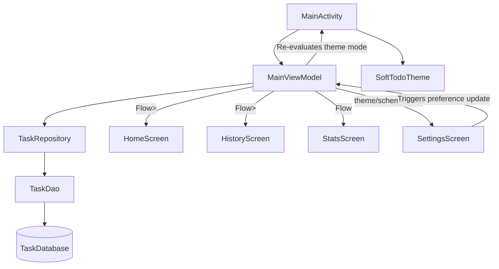

# Codebase Analysis: _MustDo_ To-Do Application

This document provides a thorough breakdown of the **MustDo** Android application architecture, mapping out files, system relationships, color/theme management, typography application, backup/restore operations, and opportunities for structural helper improvements.

---

## 1. Directory Structure & File Mapping

The codebase follows a clean MVVM structure utilizing Jetpack Compose for the UI layer, and Room Database for data persistence.

```
app/src/main/
├── AndroidManifest.xml                        # Main configuration, permissions, components registration
├── java/com/gratus/mytodo/
│   ├── MainActivity.kt                        # Host Activity, Navigation Drawer, top bar and screen switching
│   ├── components/
│   │   └── NotificationReceiver.kt           # BroadcastReceiver for scheduling/firing alarm notifications
│   ├── data/
│   │   ├── Task.kt                           # Room Entity: Task data schema
│   │   ├── TaskDao.kt                        # Data Access Object: Queries and DB updates
│   │   ├── TaskDatabase.kt                   # Room Database initializer
│   │   └── TaskRepository.kt                 # Repository layer abstracting DAO operations
│   └── ui/
│       ├── MainViewModel.kt                  # State-holder: Business logic, backup/restore, alarm scheduling
│       ├── components/
│       │   ├── FaintBackground.kt            # Draws custom canvas graphics/gradients based on theme
│       │   ├── StyledTextParser.kt           # Compiles markdown bold/italic/bullets into AnnotatedStrings
│       │   └── TaskAddDialog.kt              # Popup dialog for task creation and customization
│       ├── screens/
│       │   ├── HomeScreen.kt                 # Daily task list view, datepicker, and navigation swipe detection
│       │   ├── HistoryScreen.kt              # Calendar groups, search/filters, and zoom controls
│       │   ├── SettingsScreen.kt             # Dark/Light preferences, theme scheme selectors, and backup options
│       │   └── StatsScreen.kt                # Circular completion canvas progress, streaks, and weekly chart
│       └── theme/
│           ├── Color.kt                      # Defines core colors, priority levels, and scheme utilities
│           ├── Theme.kt                      # Integrates Light/Dark palettes into SoftTodoTheme
│           └── Type.kt                       # Houses default typography styles
└── res/
    ├── values/
    │   ├── colors.xml                        # Basic standard fallback native resource colors
    │   ├── strings.xml                       # Core localization properties
    │   └── themes.xml                        # Legacy XML style themes
    └── xml/
        └── filepath_rules.xml                # (If applicable) Native file provider rules
```

---

## 2. System Relationships & State Propagation

The app leverages a shared view model architecture to ensure state syncs instantly across all screens:



### Key Interactions:
1. **Shared ViewModel Scope:** The `MainActivity` instantiates `MainViewModel` via `by viewModels()`. This single instance is passed to all sub-screens (`HomeScreen`, `HistoryScreen`, `StatsScreen`, `SettingsScreen`), ensuring they all operate on the exact same states.
2. **Settings Propagation:** 
   - `SettingsScreen` invokes `viewModel.setTheme(mode)` and `viewModel.setColorScheme(scheme)`.
   - `MainViewModel` persists these settings in `SharedPreferences` (`soft_todo_prefs`) and publishes updates to `settingsTheme` and `settingsColorScheme` state flows.
   - `MainActivity` collects these flows as compose state. This triggers a recomposition of `SoftTodoTheme` and `FaintBackground`, changing the entire app's look instantly.
3. **Database-UI Reactive Loop:** All queries inside `TaskDao` return `Flow<List<Task>>`. Any operation (e.g. marking a task complete on the `HomeScreen`) writes to Room, which automatically forces the corresponding database flow to emit the new data. Screens instantly recompose with the updated task lists without manual refreshing.
4. **Alarms Synchronization:** When tasks are added, completed, updated, or deleted, `MainViewModel` recalculates Android `AlarmManager` exact alarms.

---

## 3. Backup and Restore Mechanism

Currently, backups are handled via raw JSON serialization and deserialization on the UI thread:

### Export Workflow
1. User clicks **Export to Clipboard** or **Backup File** in `SettingsScreen`.
2. The UI invokes `viewModel.exportBackup()`.
3. `exportBackup` runs a blocking call (`runBlocking(Dispatchers.IO)`) querying `TaskDatabase` for all tasks via `getAllTasksDirect()`.
4. It iterates over the task list, converting each field into a `JSONObject` and adding them to a `JSONArray`.
5. The stringified JSON output is copied to the clipboard via Android `ClipboardManager` or written to `soft_todo_backup.json` inside the device's standard `/Downloads` directory.

### Import & Restore Workflow
1. User clicks **Import & Restore Backup** in `SettingsScreen` which opens an `AlertDialog` paste-box.
2. User inputs the JSON string and taps **Validate & Restore**.
3. `viewModel.importBackup(jsonStr)` parses the input as a `JSONArray`.
4. It maps each item to a `Task` entity and calls `repository.insertTasks(tasks)`, which overwrites existing tasks sharing duplicate IDs (`OnConflictStrategy.REPLACE`).
5. Upon completion, a Toast notification informs the user, and alarms are rescheduled for any active, incomplete tasks.

> [!WARNING]
> **Performance Bottleneck:** Parsing large JSON strings inside the ViewModel on the UI thread can lead to frame drops (jank).
> **Usability Flaw:** Relying on copy-pasting code arrays in a dialog is highly error-prone. A native System File Picker (using SAF/Document Contracts) must replace this system.

---

## 4. Typography & Font Application

Currently, the app lacks a centralized typography structure, leading to inconsistent text sizing:

- **Type.kt** overrides only a single M3 styling token (`bodyLarge`), leaving the remaining default tokens unmapped.
- **Composable Styles:** Visual elements apply hardcoded `.sp` sizes directly inside layouts instead of pulling from standard material typography. For example:
  - `MainActivity`: Drawer items specify `fontSize = 13.sp`, signatures specify `fontSize = 10.sp`, logos specify `11.sp`.
  - `HomeScreen`: Blank state cards specify `12.sp` and `10.sp`.
  - `HistoryScreen`: Dynamic zoom layouts map specific levels to custom local variables (`titleSize` ranging from `11.sp` to `19.sp`).

### Proposed Centralization Strategy
To satisfy the requirement to **increase all font sizes across the app by 2sp** and centralize them, we should introduce a dedicated typography structure. We can achieve this by:
1. Defining all size tokens in a single `AppDimensions` utility:
   ```kotlin
   object AppTypography {
       val textMicro = 12.sp       // originally 10sp
       val textExtraSmall = 13.sp  // originally 11sp
       val textSmall = 14.sp       // originally 12sp
       val textMedium = 15.sp      // originally 13sp
       val textLarge = 18.sp       // originally 16sp
       val textTitle = 20.sp       // originally 18sp
       val textHeadline = 26.sp    // originally 24sp
   }
   ```
2. Mapping these sizes directly to standard Material 3 typography definitions (`labelSmall`, `bodySmall`, `bodyMedium`, `titleMedium`, etc.) in `Type.kt` and referencing them globally via `MaterialTheme.typography.bodySmall`.

---

## 5. Theme & Color Management

Colors are managed inside `Theme.kt` and `Color.kt` through a mixture of standard theme parameters and inline checks.

### Current Implementation:
- **`SoftTodoTheme` Selection:** Translates setting codes to M3 ColorSchemes:
  - `"minimal"`: Lavender backing + indigo accents.
  - `"simple"`: Strictly monochromatic (black/white).
  - `"colorful"`: Orchid purple + rose pastel.
  - `"system"`: Monet dynamic coloring (Android 12+).
- **Conditional Styling Checks:** Screens inspect color options directly to decide how to draw elements:
  - `HomeScreen.kt` cards render custom borders if `colorSchemeType == "simple"` or `"minimal"`.
  - Priority badge boxes call `getMinimalPriorityColors()` or `getPriorityBoxColor()` directly.

### Centralization Strategy
Rather than querying string states (like `colorSchemeType == "minimal"`) inside layouts, custom visual values should be bound to M3 color tokens or exposed via a custom CompositionLocal provider.
- We should centralize theme colors (e.g. drawer colors, border colors, priority badges) in `Color.kt` and maps them directly into custom extension attributes.
- **Drawer Fixes:** Clean minimalism and Pastel colorful drawers are reported as transparent. We will define solid backgrounds for the `NavigationDrawerSheet` container colors.

---

## 6. Recommended Helper Classes

To optimize code hygiene and ease future maintenance, we should implement several utility helpers:

1. **`DateTimeUtils`:** Centralizes date calculations. Currently, multiple class files construct redundant `SimpleDateFormat` objects. Moving this to a single, thread-safe utility will avoid allocations and standardize date conversions.
2. **`BackupManager`:** Offloads JSON processing from the `MainViewModel`. This helper will run serialization tasks on a background coroutine (`Dispatchers.IO`) and handle file writing cleanly.
3. **`AppDimensions` / `TypographyTokens`:** Holds the centralized typography sizing map (providing the global +2sp font adjustments).
4. **`AlarmHelper`:** Extracts notifications and pending intents configuration from `MainViewModel` to keep the ViewModel class strictly focused on UI state management.
